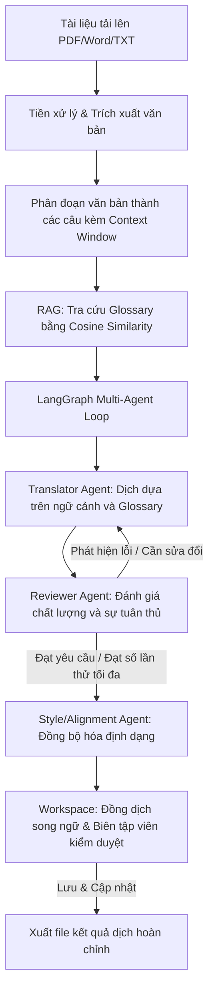

## Thành viên nhóm
1. Nguyễn Thế Giáp (Leader) - B22DCCN251
2. Nguyễn Đình Dũng - B22DCCN131
3. Phạm Minh Đức - B22DCCN239

# Smart Trans AI - Hệ thống Dịch thuật Thông minh ứng dụng AI Agent

## 📌 Giới thiệu dự án
**Smart Trans AI** là một hệ thống hỗ trợ dịch thuật thông minh (Computer-Assisted Translation - CAT Tool thế hệ mới) được thiết kế nhằm tối ưu hóa quá trình dịch thuật tài liệu chuyên ngành (Anh - Việt). 

Không giống như các công cụ dịch thuật truyền thống dịch "thô" từng câu đơn lẻ, Smart Trans AI ứng dụng kiến trúc **Multi-Agent (LangGraph)** kết hợp kỹ thuật **RAG (Retrieval-Augmented Generation)** để tự động hóa quy trình:
* **Trích xuất & Tiền xử lý:** Tự động parse tài liệu (PDF/Word), cắt nhỏ văn bản thành các câu (`Chunking`) nhưng vẫn giữ nguyên cửa sổ ngữ cảnh xung quanh để tránh mất nghĩa.
* **Hệ thống AI Tác nhân Đa tầng (Multi-Agent):** Điều khiển luồng dịch qua các Agent chuyên biệt: *Translator Agent* (Dịch thô dựa trên ngữ cảnh) $\rightarrow$ *Reviewer Agent* (Kiểm tra lỗi chính tả, ngữ pháp, độ mượt văn phong) $\rightarrow$ *Style/Alignment Agent* (Đảm bảo định dạng).
* **Đồng bộ Bộ nhớ Dịch thuật (Translation Memory) & Thuật ngữ (Glossary):** Sử dụng Vector Database để tra cứu và áp dụng chính xác các thuật ngữ chuyên ngành theo thời gian thực, đảm bảo tính nhất quán trên toàn bộ tài liệu dài.

Dự án được xây dựng với kiến trúc **MVP+ (Minimum Viable Product Plus)**, phân tách mô-đun rõ ràng, sẵn sàng mở rộng và tối ưu hóa chi phí vận hành API.

---

## 📂 Cấu trúc dự án (MVP+)
Dự án được tổ chức theo mô hình phẳng, gom cụm theo tính năng (Feature-based) ở Frontend và phân lớp nghiệp vụ ở Backend giúp tăng tốc độ phát triển trong giai đoạn đầu:

```text
smart-trans-ai/
│
├── backend/                         # Backend Source Code (FastAPI)
│   ├── app/
│   │   ├── main.py                  # Khởi tạo FastAPI, CORS, include routers
│   │   ├── core/                    # Cấu hình hệ thống (Config, Security, Constants)
│   │   ├── database.py              # Quản lý DB Session và Base Model
│   │   ├── models.py                # Định nghĩa toàn bộ các DB Models (User, Doc, Job, Glossary)
│   │   ├── schemas.py               # Định nghĩa các Pydantic Schemas (Validation dữ liệu)
│   │   ├── api/                     # Nơi tiếp nhận Request (auth.py, document.py, glossary.py)
│   │   ├── services/                # Logic nghiệp vụ (doc_processor.py, vector_service.py,...)
│   │   ├── agent/                   # Hệ thống AI Agent (graph.py, prompts.py, tools.py)
│   │   └── llm_provider.py          # Factory quản lý kết nối LLM (OpenAI, Gemini, Ollama)
│   ├── tests/                       # Unit test hệ thống
│   └── requirements.txt             # Các thư viện Python cần thiết
│
├── frontend/                        # Frontend Source Code (React.js)
│   ├── src/
│   │   ├── components/              # UI Components dùng chung (Button, Modal, Input...)
│   │   ├── features/                # Chia thư mục theo cụm tính năng cốt lõi (Mô hình Feature-based)
│   │   │   ├── auth/                # Trang Đăng nhập, Đăng ký
│   │   │   ├── dashboard/           # Giao diện quản lý danh sách tài liệu
│   │   │   ├── workspace/           # Không gian dịch thuật song ngữ, gợi ý AI, Glossary
│   │   │   └── glossary/            # Giao diện quản lý bộ từ điển thuật ngữ
│   │   ├── services/                # Axios API Client kết nối sang Backend
│   │   ├── App.jsx
│   │   └── main.jsx
│
└── docs/                            # Tài liệu dự án và báo cáo
    ├── api_spec.md                  # Tài liệu đặc tả API
    ├── database_design.md           # Tài liệu thiết kế DB
    └── complete-report-guide.md     # Hướng dẫn và cấu trúc bài tập lớn cuối kỳ

```

---

## 🛠️ Thư viện và công cụ cần thiết

### Backend (Python FastAPI)
Cài đặt các thư viện được định nghĩa trong `backend/requirements.txt`:
```bash
cd backend
pip install -r requirements.txt
```
Các thư viện cốt lõi gồm:
* `fastapi` & `uvicorn`: Framework xây dựng API.
* `sqlalchemy` & `sqlite`: Cơ sở dữ liệu lưu trữ tài liệu, từ điển và người dùng.
* `langgraph` & `langchain-openai`: Quản lý đồ thị trạng thái Agent (LangGraph State Graph) và kết nối LLM.
* `PyPDF2` & `python-docx`: Tiền xử lý tài liệu định dạng PDF và Microsoft Word.
* `pyjwt` & `bcrypt`: Xác thực mã hóa mật khẩu và quản lý phiên đăng nhập JWT.

### Frontend (React.js + Vite)
Cài đặt các package của Frontend:
```bash
cd frontend
npm install
```
Các thư viện phụ thuộc:
* `react-router-dom`: Quản lý các route giao diện (Login, Dashboard, Workspace, Glossary).
* `axios`: Client gửi request HTTP đến FastAPI backend.

---

## 🔌 Đặc tả các API chính

Hệ thống cung cấp các endpoint API sau (Base URL: `http://localhost:8000/api`):

| Nhóm chức năng | Endpoint | Method | Mô tả chức năng |
| :--- | :--- | :---: | :--- |
| **Xác thực** | `/auth/register` | POST | Đăng ký tài khoản mới |
| | `/auth/login` | POST | Đăng nhập & trả về JWT Token |
| | `/auth/me` | GET | Lấy thông tin tài khoản hiện tại |
| **Từ điển** | `/glossary/` | GET | Lấy danh sách thuật ngữ Glossary của người dùng |
| | `/glossary/` | POST | Thêm thuật ngữ mới vào từ điển chuyên ngành |
| | `/glossary/upload` | POST | Tải lên tệp tin từ điển (JSON/MD/TXT) và tự động bóc tách |
| | `/glossary/{id}` | PUT | Sửa thuật ngữ |
| | `/glossary/{id}` | DELETE| Xóa thuật ngữ |
| **Tài liệu** | `/document/upload`| POST | Tải lên tài liệu PDF/Word/TXT & Tự động chia nhỏ câu |
| | `/document/` | GET | Lấy danh sách tài liệu đã tải lên |
| | `/document/{id}` | GET | Lấy chi tiết tài liệu & các đoạn văn bản (chunks) |
| | `/document/{id}/translate`| POST | Kích hoạt tác nhân AI dịch toàn bộ tài liệu (Background Task) |
| | `/document/chunk/{chunk_id}`| PUT | Chỉnh sửa và lưu lại bản dịch thủ công (Human-in-the-loop) |
| | `/document/{id}/export` | GET | Xuất bản dịch và tải xuống dưới dạng file `.txt` |

---

## 🌀 Luồng thực hiện chính của hệ thống (System Flow)

Quy trình dịch thuật thông minh của **Smart Trans AI** diễn ra qua 4 bước khép kín:



### 1. Phân đoạn bảo toàn cấu trúc (Context-aware Chunking)
Hệ thống sử dụng dịch vụ `doc_processor` để trích xuất text từ tệp gốc và chia nhỏ văn bản thành các câu đơn lẻ. Với mỗi câu, hệ thống tự động bao bọc bằng một **Cửa sổ ngữ cảnh (Context Window)** gồm 2 câu liền trước và 2 câu liền sau. Điều này giúp LLM hiểu rõ mạch văn dịch thuật, lựa chọn danh xưng, đại từ phù hợp.

### 2. Glossary RAG (Tra cứu thuật ngữ động)
Hệ thống sử dụng cơ chế lai kết hợp giữa đối sánh từ khóa chính xác và thuật toán tính độ tương đồng **Cosine Similarity** dựa trên n-gram để lọc ra toàn bộ các cặp thuật ngữ chuyên ngành có trong câu gốc. Các cặp thuật ngữ này được định dạng thành một block chỉ dẫn Glossary và tiêm trực tiếp vào System Prompt của Agent, đảm bảo tính nhất quán của thuật ngữ kỹ thuật.

### 3. Quy trình dịch thuật Agent đa tầng (LangGraph State Machine)
Được quản lý thông qua đồ thị trạng thái của LangGraph:
* **Translator Agent**: Thực hiện bản dịch ban đầu dựa trên câu gốc, ngữ cảnh xung quanh và chỉ dẫn từ điển.
* **Reviewer Agent**: Sử dụng bộ chỉ dẫn đánh giá học thuật để thẩm định bản dịch. Nếu phát hiện lỗi chính tả, sai thuật ngữ hoặc dịch thiếu tự nhiên, Reviewer sẽ đánh dấu lỗi, đề xuất bản sửa lỗi và kích hoạt Agent Translator thực hiện dịch lại (tối đa 3 vòng lặp).
* **Style/Alignment Agent**: Khi bản dịch đã được thông qua, Agent này tiến hành đồng bộ các dấu câu, ký tự đặc biệt, định dạng Markdown hoặc các công thức LaTeX toán học để đảm bảo khớp 100% với tệp gốc.

### 4. Cộng tác Người - Máy (Human-in-the-loop)
Sau khi AI Agent dịch xong, người dùng có thể truy cập **Bảng Workspace song ngữ**, tại đây giao diện sẽ hiển thị trực quan bản gốc bên trái và bản dịch bên phải. Khi nhấn vào từng câu, người dùng có thể xem:
* Từ điển thuật ngữ (Glossary) đã được áp dụng cho câu đó.
* Nhận xét đánh giá (Critique/Feedback) từ Reviewer Agent để biết tại sao câu đó được dịch như vậy.
* Thực hiện chỉnh sửa trực tiếp và bấm lưu để cập nhật lại hệ thống trước khi xuất tệp văn bản dịch cuối cùng.

---

## 🚀 Hướng dẫn khởi chạy dự án

Hệ thống hỗ trợ 2 cách khởi chạy và vận hành chính tùy theo nhu cầu:

---

### CÁCH 1: Khởi chạy Môi trường Phát triển (Web Developer Mode)
Dành cho lập trình viên muốn chỉnh sửa code và chạy hot-reload cho cả backend và frontend.

#### Bước 1: Cấu hình biến môi trường
Tạo file `.env` tại thư mục `/backend` (sử dụng nội dung từ mẫu dưới đây):
```env
DATABASE_URL=sqlite:///./smart_trans.db
JWT_SECRET=supersecretjwtkeychangeinproduction12345
JWT_ALGORITHM=HS256
ACCESS_TOKEN_EXPIRE_MINUTES=1440

# Cấu hình OpenRouter API để kết nối LLM (Gemini, GPT...)
OPENROUTER_API_KEY=your_openrouter_api_key_here
OPENROUTER_MODEL=google/gemini-2.5-pro
OPENROUTER_BASE_URL=https://openrouter.ai/api/v1
```

#### Bước 2: Khởi chạy Backend FastAPI
1. Mở một terminal mới, di chuyển vào thư mục backend:
   ```bash
   cd backend
   ```
2. Kích hoạt môi trường ảo (nếu có) và cài đặt thư viện:
   ```bash
   pip install -r requirements.txt
   ```
3. Chạy Server FastAPI với chế độ hot-reload:
   ```bash
   python -m uvicorn app.main:app --host 127.0.0.1 --port 8000 --reload
   ```
*API docs tương tác sẽ tự động được hiển thị tại:* [http://127.0.0.1:8000/docs](http://127.0.0.1:8000/docs)

#### Bước 3: Khởi chạy Frontend React (Vite)
1. Mở một terminal song song khác, di chuyển vào thư mục frontend:
   ```bash
   cd frontend
   ```
2. Cài đặt các thư viện phụ thuộc:
   ```bash
   npm install
   ```
3. Chạy ứng dụng ở chế độ phát triển:
   ```bash
   npm run dev
   ```
4. Truy cập giao diện chính của hệ thống tại trình duyệt: [http://localhost:5173](http://localhost:5173)

---

### CÁCH 2: Đóng gói & Khởi chạy ứng dụng Desktop (Single Executable App)
Dành cho người sử dụng cuối (End-user) hoặc khi muốn phân phối ứng dụng gọn nhẹ dưới dạng một file chạy độc lập `.exe` chạy trên Windows không cần cài đặt Node.js/Python.

#### Bước 1: Chuẩn bị biến môi trường
Đảm bảo đã tạo cấu hình file `.env` chính xác tại `/backend/.env` như ở Cách 1 (Hệ thống đóng gói sẽ tự đọc file này để làm cấu hình).

#### Bước 2: Chạy kịch bản tự động đóng gói
Tại thư mục gốc của dự án, mở terminal PowerShell và chạy lệnh:
```bash
python build_desktop.py
```
**Quy trình đóng gói tự động sẽ thực hiện:**
1. Build React frontend tĩnh thành các file HTML/JS/CSS trong thư mục `frontend/dist`.
2. Tải và thiết lập thư viện PyInstaller.
3. Đóng gói mã nguồn Python Backend, các file static của Frontend, và các thư viện liên quan thành một file thực thi duy nhất.

#### Bước 3: Khởi chạy ứng dụng Desktop
1. Sau khi build hoàn thành, di chuyển tới thư mục `dist_desktop/`:
   ```bash
   cd dist_desktop
   ```
2. Chạy file thực thi: **`SmartTransAI.exe`** (hoặc double-click trực tiếp trong File Explorer).
3. Mở trình duyệt web và truy cập: [http://localhost:8000](http://localhost:8000) để sử dụng toàn bộ ứng dụng chạy offline cục bộ.

---

---

## 🧪 Kịch bản kiểm thử chi tiết (Testing Scenarios)

Để thẩm định toàn diện các tính năng của hệ thống Smart Trans AI, vui lòng thực hiện kiểm thử theo các bước tuần tự dưới đây:

### 1. Kiểm thử xác thực API độc lập (FastAPI Swagger Docs)
1. Đảm bảo Backend FastAPI đang chạy tại cổng 8000.
2. Mở trình duyệt truy cập: `http://127.0.0.1:8000/docs`.
3. Tìm đến API `/api/auth/register`, bấm **Try it out**, điền tài khoản thử nghiệm mới và bấm **Execute** để đăng ký.
4. Sử dụng tài khoản vừa đăng ký tại endpoint `/api/auth/login` để thực hiện đăng nhập. Sao chép chuỗi mã hóa trong thuộc tính `access_token` nhận được ở phản hồi.
5. Nhấp nút **Authorize** ở góc trên cùng bên phải giao diện Swagger Docs, nhập token dưới dạng `Bearer [Token_vừa_copy]` để kiểm thử các API bảo mật khác (như lấy thông tin `/api/auth/me`).

### 2. Kiểm thử đăng ký & đăng nhập trên giao diện (Frontend Auth)
1. Mở trình duyệt truy cập: `http://localhost:5173`. Hệ thống sẽ tự động chuyển hướng người dùng chưa đăng nhập về trang đăng nhập `/login`.
2. Trên màn hình **Smart Trans AI** kính mờ, chọn **Đăng ký ngay** để tạo tài khoản mới (ví dụ: `censor_test`, mật khẩu: `123456`).
3. Sau khi hiển thị thông báo thành công, nhập tài khoản vừa tạo để đăng nhập. Trình duyệt sẽ lưu token và chuyển hướng bạn đến màn hình Dashboard.

### 3. Nạp từ điển chuyên ngành (Glossary RAG)
1. Nhấp chọn mục **Từ điển chuyên ngành** trên thanh Sidebar bên trái.
2. Tạo hai thuật ngữ mẫu phục vụ đối sánh:
   * **Thuật ngữ gốc (Tiếng Anh)**: `AI Agent` | **Bản dịch (Tiếng Việt)**: `Tác nhân AI` | **Ghi chú**: `Hệ thống tự động`
   * **Thuật ngữ gốc (Tiếng Anh)**: `Context Window` | **Bản dịch (Tiếng Việt)**: `Cửa sổ ngữ cảnh` | **Ghi chú**: `Ngữ cảnh bao quanh`
3. Nhấp nút **Thêm từ** và xác nhận thuật ngữ hiển thị đầy đủ trong bảng tra cứu bên phải.
4. Thử tính năng **Sửa** (cập nhật ghi chú) và **Xóa** để xác minh các tác vụ CRUD Glossary hoạt động đúng.

### 4. Upload tài liệu & Phân đoạn tự động
1. Nhấp chọn mục **Tài liệu** trên thanh Sidebar để quay lại Dashboard.
2. Tạo một file văn bản thô `.txt` (hoặc file `.docx`/`.pdf`) với nội dung học thuật ngắn:
   > "An AI Agent performs actions based on context. The Context Window determines what text is visible."
3. Nhấp vào vùng kéo thả nét đứt **Upload Zone** và chọn tệp tin vừa tạo để tải lên.
4. Xác nhận tài liệu mới xuất hiện trong danh sách bên dưới với trạng thái **Đã tải lên** (màu xám).

### 5. Dịch thuật tự động bằng LangGraph Agent (Background Polling)
1. Hãy điền đầy đủ API Key OpenRouter của bạn trong file `.env` ở backend trước khi chạy bước này.
2. Bấm nút **🤖 Dịch AI** bên dưới thẻ tài liệu vừa tải lên.
3. Trạng thái thẻ sẽ lập tức đổi thành **Đang dịch...** (màu tím) và nút bấm sẽ chuyển sang trạng thái vô hiệu hóa kèm icon sấm sét.
4. Hệ thống chạy tiến trình ngầm (Background Task) để gửi từng phân đoạn câu qua đồ thị LangGraph. Nhờ cơ chế polling tự động sau mỗi 4 giây từ Frontend, khi toàn bộ câu dịch xong, trạng thái tài liệu sẽ chuyển sang màu xanh lá **Đã dịch xong**.

### 6. Biên tập song ngữ & Đồng dịch (Human-in-the-loop)
1. Bấm nút **🔍 Mở Workspace** trên thẻ tài liệu để chuyển đến khu vực dịch song ngữ.
2. Giao diện chia đôi màn hình sẽ xuất hiện, câu gốc tiếng Anh bên trái và bản dịch tiếng Việt bên phải.
3. Nhấp chuột vào câu đầu tiên:
   * Xem khung gợi ý **AI Agent** hiển thị bản dịch tiếng Việt của AI.
   * Xem hộp **Ý kiến Reviewer** hiển thị bình luận sửa đổi của Reviewer Agent.
   * Tại khung **Thuật ngữ phù hợp (RAG)**, xác nhận từ khóa `AI Agent` -> `Tác nhân AI` được bóc tách chính xác từ từ điển Glossary.
4. Tiến hành sửa bản dịch trong khung soạn thảo văn bản (ví dụ: tinh chỉnh cho câu mượt hơn) và nhấp **Lưu & Chuyển câu kế tiếp**.
5. Xác nhận bản dịch hiển thị cập nhật bên cột Tiếng Việt và xuất hiện biểu tượng **✍️ Đã hiệu chỉnh** (màu xanh dương).

### 7. Xuất bản dịch hoàn chỉnh
1. Trên thanh công cụ trên cùng của Workspace, nhấp nút **📤 Xuất file dịch (.txt)**.
2. Xác nhận trình duyệt tải xuống tệp văn bản dạng `.txt` (ví dụ: `translated_sample.txt`) chứa đầy đủ các phân đoạn dịch tiếng Việt được nối ghép hoàn chỉnh theo cấu trúc.


